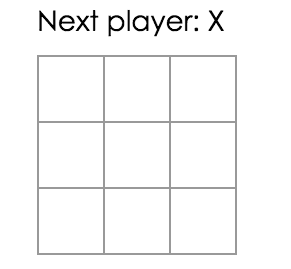
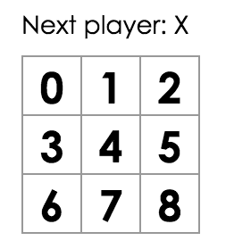

#a.md


What is React?


React is declaractive, efficient, and flexible JavaScript library for building user interfaces. 

It lets you compose complex UIs from small and isolated pieces of code called "components".

React has a few different kinds of components, but we'll start with `React.Component` subclasses:


```
class ShoppingList extends React.Component {
	render() {
		return (
			<div className="shopping-list">
				<h1>Shopping List for {this.props.name}</h1>
				<ul>
					<li>Instagram</li>
					<li>WhatsApp</li>
					<li>Oculus</li>
				</ul>
			</div>
		);
	}
}

// Example usage: <ShoppingList name="Mark" />
```


We'll get to the funny XML-like tags soon. We use components to tell React what we want to see on the screen. When out data changes, React will efficiently update and re-render our components.


Here, ShoppingList is a **React component class**, or **React component type**. A component takes in parameters, called `props`(short for "properties"), and returns a hierarchy of views to display via the `render` method.


The `render` method returns a description of what you want to see on the screeen. React takes the description and displays the result. In particular, `render` returns a **React element**, which is a lightweight description of what to render.

Most React developers use a special syntax called "JSX" which makes these structures easier to write.

The `<div />` syntax is transformed at build time to `React.createElement('div')`. The example above is equivalent to:

```

return React.createElement('div', {className: 'shopping-list'},
	React.createElement('h1', /* ... h1 children ... */),
	React.createElement('ul', /* ... ul children ... */)
);

```

If you're curious, `createElement` is described in more detail in the `API reference`, but we won't be using it in this tutorial. Instead, we will keep using JSX.

JSX comes with the full power of JavaScript. You can put any JavaScript expression within braces inside JSX. But you can compose and render custom React components too. For example, we can now refer to the whole shopping list by writing `<ShoppingList />`. Each React component is is encapsulated and can operate independently; this allows you to build complex UIs from simple components.

----

### Inspecting the Starter Code

By inspecting the code, you'll notice that we have three React components:

- Square
- Board
- Game

The Square component renders a single `<button>` and the Board renders 9 squares. The Game component renders a board with placeholder values which we'll modify later. There are currently no interactive components.


----

### Passing Data Through Props

To get our feet wet, let's try passing some data from our Board component to our Square component.

We strongly recommended **typing code by hand** as you're working through the tutorial and not using copy/paste. This will help you **develop muscle memory and a stronger understanding.**

In Board's `renderSquare` method, change the code to pass a prop called `value` to the Square:

```
class Board extends React.Component {
	renderSquare(i) {
		return <Square value={i} />;
	}
}
```

Change Square's `render` method to show that value by replacing `{/* TODO */}` with `{this.props.value}`:

```
class Square exteds React.Component {
	render() {
		return (
			<button className="square">
				{this.props.value}
			</button>
		)
	}
}

```

Before:



After. You should see a number in each square in the rendered output.




Congratulations! You've just "passed a prop" from a parent Board component to a child Square component. Passing props is how information flows in React apps, from parents to children.


----

### Making an Interactive Component

Let's fill the Square component with an "X" when we click it. First, change the button tag that is returned from the Square component's `render()` function to this:

```

class Square extends React.Component {
	render() {
		return (
			<button className="square" onClick={function() { alert('click'); }}>
				{this.props.value}
			</button>
		);
	}
}

```

If you click on a Square now, you should see an alter in your browser.


